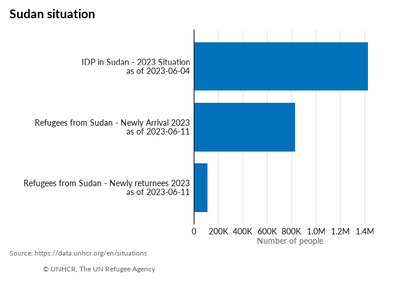

<!-- README.md is generated from README.Rmd. Please edit that file -->

# unhcrdataportal

<!-- badges: start -->

[](https://github.com/Edouard-Legoupil/unhcrdataportal/actions/workflows/R-CMD-check.yaml)
<!-- badges: end -->

The goal of unhcrdataportal is to retrieve data from UNHCR Data Portal
within an R session.

Retrieving this data allows to perform quick quality assurance control.

## Installation

You can install the development version of unhcrdataportal from
[GitHub](https://github.com/) with:

``` r
# install.packages("pak")
pak::pkg_install("Edouard-Legoupil/unhcrdataportal")
```

Note that if you are on windows, you will need to have Rtools installed
on your machine

## Example

This is a basic example

``` r
library(unhcrdataportal)
## basic example code
page = "Sudan situation"
datasitpop <- odp(page = page,
               dataset = "population") |> 
  ## extract the data
  purrr::map( "data") |>
  ## Bind together in a data frame
  purrr::list_rbind()

library(ggplot2)
datasitpop |>
  ggplot() +
  geom_col(aes(x = as.integer(individuals),
               y = reorder( glue::glue("{population_group_name} \n as of {date}"), 
                                        as.integer(individuals) )),
           fill = unhcrthemes::unhcr_pal(n = 1, "pal_blue"),
           width = 0.8) +
  labs(title = paste0(page),
       x = "Number of people",
       y = "",
       caption = "Source: https://data.unhcr.org/en/situations \n
                   © UNHCR, The UN Refugee Agency") +
  scale_x_continuous(expand = expansion(c(0, 0.1)),
                     breaks = scales::pretty_breaks(n = 7),
                     labels = scales::label_number(scale_cut = scales::cut_short_scale())) +
  unhcrthemes::theme_unhcr(
              font_size = 12,
              grid = "X",
              axis = "y")
```


